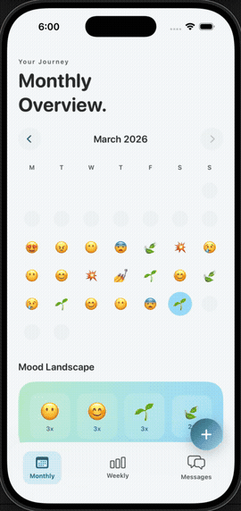

# DigitalSanctuary

A native iOS mood-tracking application built with SwiftUI and SwiftData. Designed around the idea that emotional self-awareness compounds — small daily check-ins surface patterns, and patterns surface insight.

---

## Demo

<div align="center">
  
</div>

---

## Product

### Daily Entry
Log a mood, a reflection (up to 200 characters), and up to 4 photos via a modal sheet. Accessible from any tab via the persistent FAB or by tapping any calendar or week day. Supports both built-in moods and user-defined custom moods — each with a user-picked emoji and label. Sentiment polarity (positive/negative) is auto-inferred from the emoji via a lookup table. Past entries load automatically when a previous date is opened; saving updates in place.

### Monthly View
A 7-column calendar grid where each logged day renders its mood emoji. Long-pressing any cell triggers a floating emoji picker — a drag-to-select interaction modelled after iOS native emoji reactions — allowing quick mood assignment without navigating away. The view also includes a top-4 mood frequency cloud, trend statistics (dominant mood, log count, positive-day percentage), and an AI-generated narrative summary of the month.

### Weekly View
A full-width 7-day strip showing all days of the week simultaneously — each card displays the day's emoji, date number, and mood label. Accompanied by a weekly synthesis card (dominant mood, days logged) and a chronological reflection list.

### Sanctuary Echoes
A community encouragement tab. Pre-seeded with anonymous messages tagged to specific moods — messages relevant to the user's most recent mood entry are surfaced first. Users contribute new messages via a dashed-border prompt card inline at the top of the feed. Fully local; no backend required.

### AI Narrative Arc
Integrates the Anthropic Claude API (Haiku) to generate a personalised monthly summary from the user's mood log. Produces a poetic headline (with mixed italic styling) and a 2–4 sentence narrative paragraph with accent-coloured emphasis. Results are cached per month in `UserDefaults` and regenerated on demand. Rate-limit safe: a per-generation guard prevents concurrent requests, and cached months never re-call the API.

---

## Technical Highlights

### Gesture Engineering
The calendar's long-press picker uses a single `DragGesture(minimumDistance: 0)` combined with a 0.45-second `Timer`, rather than SwiftUI's `LongPressGesture.sequenced(before: DragGesture)`. This eliminates the tap/long-press conflict inherent in sequenced gesture recognisers: a quick lift cancels the timer and fires navigation, while a sustained hold triggers the picker and transitions into drag-to-select mode. Scroll gestures are preserved by cancelling the timer on translation > 8pt. Timer and gesture state are cleaned up in `.onDisappear` to prevent stale closures.

### Extensible Mood System
`MoodType` is a Swift enum covering seven built-in moods. Custom moods extend this at runtime via a `CustomMood` SwiftData model. A `MoodSelection` value type unifies both at the selection layer, so `EmojiPickerView`, `DailyView`, and the save path are decoupled from the enum entirely. `MoodEntry` stores `moodRaw` (emoji string) alongside `moodLabel` and `moodIsPositive` for custom moods, with computed `resolvedLabel` and `resolvedIsPositive` properties that fall back to the built-in enum for legacy entries — no migration required.

The emoji picker renders as a paginated `TabView` with page dots: 7 mood slots per page with the Add button pinned to slot 8. Custom moods created mid-session appear on subsequent pages immediately.

### Design System
All UI tokens are centralised in a `DesignSystem/` layer: a `Color` extension with semantic `ds`-prefixed tokens, a `Font` extension with a five-level type scale, and `ViewModifier` implementations for card surfaces and glassmorphism. No raw hex values or system font sizes appear in view code.

### Persistence & Live Updates
SwiftData with three models: `MoodEntry`, `CustomMood`, `CommunityMessage`. External storage for photo binary data. All queries use `FetchDescriptor` with date-range predicates. Because monthly and weekly views fetch into `@State` arrays (enabling dynamic predicate filtering not supported by `@Query`), a `refreshTrigger` integer is threaded from `ContentView` down to both views — incrementing on every save causes an immediate re-fetch without requiring `@Query` or notification observers.

### Sheet Navigation
All entry creation and editing uses a single `sheet(item:)` at the root `ContentView` level. The item is an `EntryTarget` struct with a stable `UUID` — guaranteeing SwiftUI creates a fresh `DailyView` on every presentation and avoids stale-capture bugs that occur with `sheet(isPresented:)` when the bound date changes before the sheet opens.

### AI Integration
`AISummaryService` calls the Anthropic Messages API directly via `URLSession` — no third-party SDK. The prompt instructs the model to return structured JSON (`{"headline": "...", "summary": "..."}`), with `*asterisk*` markers for italic spans and `**double asterisk**` for accent-coloured words, which `AIMonthlySummaryView` parses and renders using SwiftUI's `Text` concatenation API. The service checks HTTP status before attempting JSON decode, surfacing API-level errors (rate limit, auth) with their actual message rather than a generic parse failure.

---

## Architecture

```
ContentView                  ← root ZStack: tab router + nav bar + FAB + sheet(item:)
├── MonthlyView              ← calendar, top-4 mood cloud, trend stats, AI summary
│   └── CalendarGridView     ← long-press quick picker
├── WeeklyView               ← 7-day full-width strip, synthesis card, reflections
└── CommunityView            ← Sanctuary Echoes feed + inline add prompt
    └── DailyView (sheet)    ← entry form (mood picker, reflection, photos)
        └── EmojiPickerView  ← paginated TabView: 7 moods + Add per page
```

Navigation is tab-based via an `AppTab` enum (Monthly · Weekly · Messages). The FAB is rendered in the root `ZStack` and opens the entry sheet on all tabs. Tapping any calendar or week-day cell sets an `EntryTarget` date and opens the same sheet.

---

## Stack

| | |
|---|---|
| Language | Swift 5.9 |
| UI | SwiftUI |
| Persistence | SwiftData (iOS 17+) |
| AI | Anthropic Claude API (Haiku) |
| Dependencies | None (zero third-party packages) |
| Minimum target | iOS 17 |

---

## Running Locally

1. Clone the repository
2. Open `DigitalSanctuary.xcodeproj` in Xcode 15+
3. Select a simulator or device running iOS 17+
4. Open `DigitalSanctuary/Utilities/Secrets.swift` and replace the placeholder with your Anthropic API key
5. Build and run — all core features work without any additional configuration
